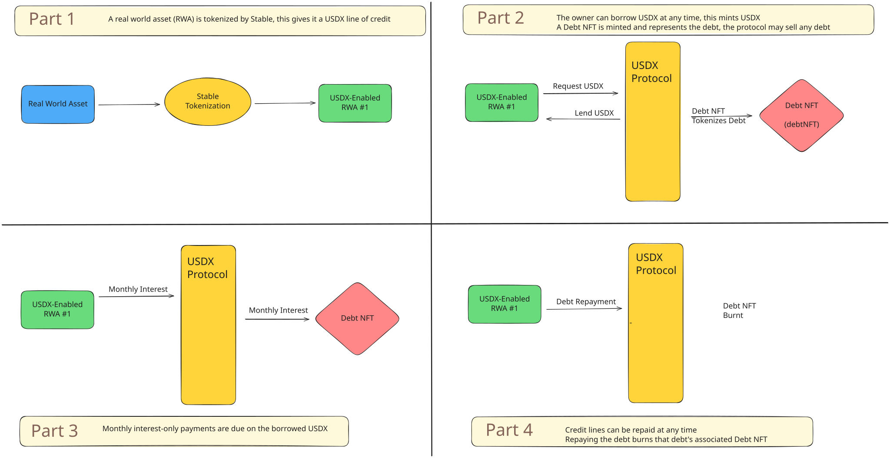

# Solution

## Solution

USDX is a USD-pegged CDP stablecoin that is created when a borrow position is created and drawn against an approved asset. CDP is an abbreviation for collateralized debt position, which is simply a debt where the borrower has pledged collateral. USDX is overcollateralized by a basket of debt positions on a basket of assets.

To keep things simple, and because real estate is one of the most relatable assets, this paper focuses on real estate as the asset being posted as collateral for the debt positions backing USDX.

Here’s how USDX works:

<figure><figcaption></figcaption></figure>

1. Real Estate is Tokenized by Stable, this enables it to have a USDX line of credit
2. The line of credit is drawn drawn against, and the borrower is lent USDX
3. Open lines of credit collect monthly interest-only payments
4. When the line of credit is paid off the Debt NFT is burnt

USDX can be borrowed against an asset by its owner, or lent to other borrowers who pay a yield for it and post their own collateral. Depending on the asset type and a variety of factors a LTV is assigned, and USDX can be minted (drawn) up to that LTV.

For example, if a:

* $42MM student housing in Texas
* $30MM of homes in South Carolina
* $10MM farm in Arkansas
* $8MM land portfolio in Wyoming

Were deposited into Stable’s treasury, up to 69MM USDX could be minted. The combined value of those real estate assets is $90MM, or \~130% of the value of the maximum number of USDX minted.

 
