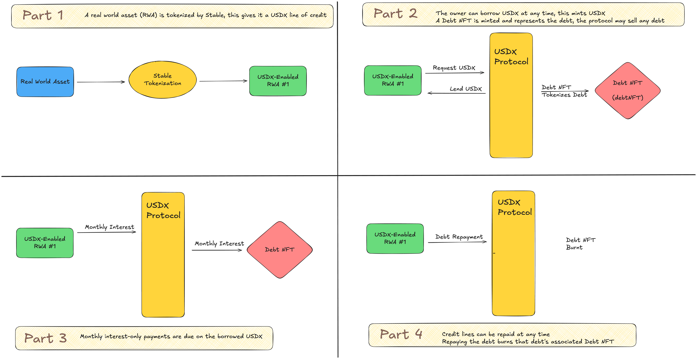

# How USDX Works

## Overview

USDX is a collateralized debt position (CDP) stablecoin minted against real world assets (RWAs). Stable invented USDX to solve the liquidity problem faced by tokenized assets and to provide exposure to the yield of mortgage capital markets onchain. Both Stable and approved partners are able to mint USDX by submitting mortgages that fit the [protocol's guidelines](../minting-usdx.md).&#x20;

While USDX is over-collateralized by the assets which are mortgaged, and collateralized by the mortgages themselves, Stable works with various institutions to ensure [dollar liquidity](../redeeming-usdx.md) for USDX through lines of credit and reserves.

By staking USDX, members of the community can gain exposure to the [yield of mortgages](../staking-usdx.md) backing USDX through mUSDX, a yieldcoin.&#x20;

## How USDX Works

<figure><figcaption></figcaption></figure>

#### Part 1

A real world asset (RWA) is tokenized by Stable, this gives it a USDX line of credit.

<figure><figcaption></figcaption></figure>

#### Part 2

The owner can borrow USDX at any time, this mints USDX. A Debt NFT is minted and represents the debt, the protocol may sell any debt.

<figure><figcaption></figcaption></figure>

#### Part 3

Monthly interest-only payments are due on the borrowed USDX

<figure><figcaption></figcaption></figure>

#### Part 4

Credit lines can be repaid at any time. Repaying the debt burns that debt's associated Debt NFT.

<figure><figcaption></figcaption></figure>

## Whitepaper

You can find the USDX Whitepaper [here in the docs](../../usdx-whitepaper/) or in full in the [Whitepaper GitHub Repository](https://github.com/Stable-Finance/whitepaper/).
