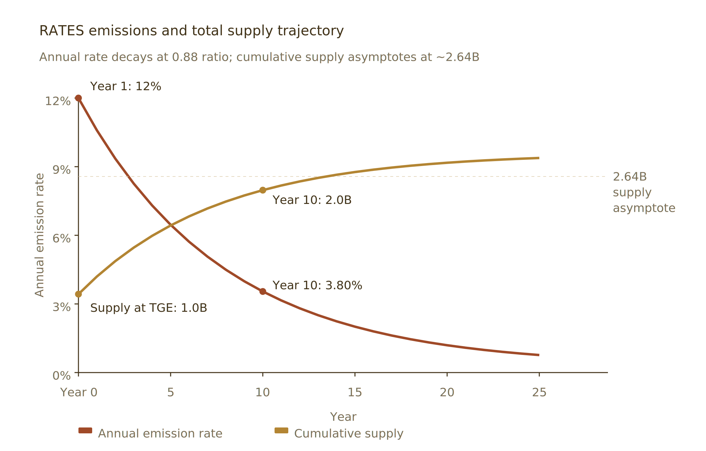

# Appendix C — RATES Reference

## 19. Appendix C — RATES Reference

RATES is the protocol's validator, safety-module, and governance token. Its full tokenomics — initial supply, distribution, emissions schedule, activity gating, buyback-and-burn, permanent protocol capital, and supply dynamics — are specified in the separate **RATES paper**. This appendix carries only the parameters the USDX body references directly.

**Genesis supply.** RATES has a fixed initial supply of **1,000,000,000 tokens (1B)** at genesis. Additional supply is created post-genesis only via the loss waterfall (Section 8) and a geometrically decaying emissions schedule. The annual emission rate decays at a 0.88 ratio — from roughly 12% in Year 1 to roughly 3.80% by Year 10 — and cumulative supply asymptotes at approximately 2.64B tokens, as illustrated below. The precise schedule and its asymptotic supply cap are specified in the RATES paper.

<figure><figcaption>
RATES emissions and total supply trajectory. Annual rate decays at a 0.88 ratio; cumulative supply asymptotes at ~2.64B.
</figcaption></figure>

**Tranche coverage bands.** Each loss-waterfall tranche (Section 8.2) operates within a coverage band, expressed as a percentage of outstanding USDX supply:

| Tranche | Minimum coverage | Maximum coverage |
| --- | --- | --- |
| Tranche 1 — RATES safety module | 0.5% | 10% |
| Tranche 2 — Stablecoin vault | 1% | 10% |
| Tranche 3 — mUSDX | 2% | 10% |

The mechanics governing how tranche emissions split between staker rewards and protocol-owned capacity building, the emissions split across validators and tranches, and all other supply dynamics are specified in the RATES paper.

---

_This whitepaper is a technical description of the USDX protocol as designed. It does not constitute an offer to sell, or the solicitation of an offer to buy, any security or financial instrument. Any forward-looking statements reflect the current intentions of the protocol's developers as of the publication date and are subject to change based on technical, regulatory, and market developments. Prospective users should consult the latest protocol documentation and, where applicable, their own legal and financial advisors._

_Stable Company · Version 0.2 · May 2026 · trystable.co_
