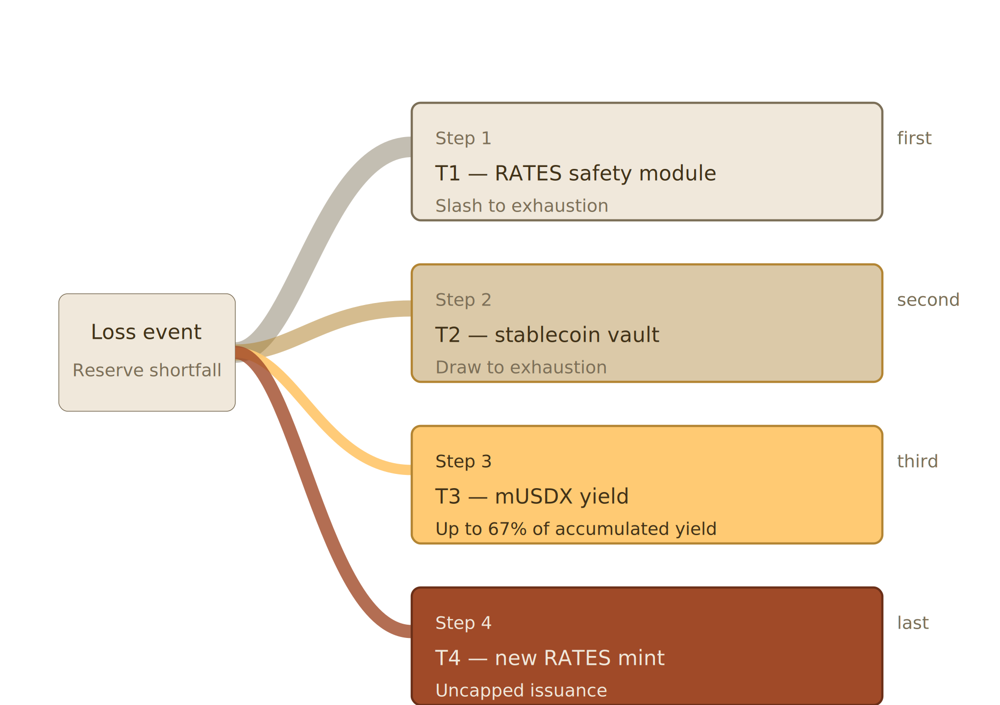

# Risk Management and the Loss Waterfall

## 8. Risk Management and the Loss Waterfall

### 8.1 Principles

A stablecoin collateralized by a real-asset portfolio must have an explicit and credible mechanism for absorbing losses. Credit losses on whole loans, mark-to-market deficits during a forced liquidation, operational errors, or smart contract incidents can all produce a situation in which reserves fall below outstanding supply. The protocol specifies a four-step loss waterfall, operating in strict seniority, that routes losses through buffer mechanisms before they impact USDX holders.

### 8.2 Tranches

Losses are absorbed across four tranches, ordered from first-loss to last-resort. Each tranche operates within a coverage band — a target size expressed as a percentage of outstanding USDX supply — specified in Appendix C. The combined first-loss capacity (Tranches 1 through 3) is sized so that the protocol targets absorbing a portfolio-wide loss on the order of 30% before existing RATES holders face unbounded dilution; this target far exceeds any loss event in the modern history of agency MBS or well-underwritten whole loans.

**Tranche 1 — RATES Safety Module.** Staked RATES tokens in the safety module contract. The first tranche to absorb loss, and slashed to exhaustion before any subsequent tranche is touched. RATES stakers accept first-loss exposure in exchange for a share of protocol fees, RATES emissions (specified in the RATES paper), and the economic benefits of validator participation (Section 9).

**Tranche 2 — Stablecoin Staking Vault.** A staking vault that accepts supported stablecoins (distinct from USDX) in exchange for a yield-bearing staking receipt. Depositors earn an above-market stablecoin yield — sourced from base protocol revenue, RATES emissions, and APMB trading gains (Section 7.4) — in exchange for accepting second-loss exposure and a withdrawal delay. Tranche 2 is drawn to exhaustion after Tranche 1. When the waterfall is inactive, Tranche 2 capital is deployed as APMB working capital for peg defense; withdrawal is subject to a cooldown that compensates the protocol for the operational commitment and correspondingly elevates the tranche's yield.

**Tranche 3 — mUSDX Yield Absorption.** The mUSDX staking system (Section 6). mUSDX holders have explicitly accepted yield-bearing exposure to the mortgage portfolio. In a loss event, after Tranches 1 and 2 are exhausted, the protocol may reduce the mUSDX exchange rate to absorb loss — but only up to 67% of the yield accumulated in the exchange rate above 1.00. This produces a firm floor of 33% of accumulated yield below which the exchange rate cannot fall through the loss waterfall, protecting the base principal position of mUSDX holders.

**Tranche 4 — New RATES Minting.** Issuance of new RATES tokens that are sold to raise capital for the reserve. Tranche 4 is the final backstop and is uncapped: dilution of existing RATES holders continues until the loss is fully absorbed.

Unstaked USDX is the instrument being protected. Except in the deepest-tail scenario in which all tranches are exhausted (Section 8.4), unstaked USDX remains redeemable at par throughout any loss event. While the waterfall is active, the expedited redemption path is suspended and redemptions are processed on the default and extended schedules only, so that orderly liquidation rather than a redemption race governs the protocol's response to a shortfall.

### 8.3 Four-Step Loss Absorption

The waterfall proceeds in four sequential steps. Each step fires only if the prior step's absorption is insufficient to cover the remaining shortfall. There are no parallel draws, no rounds, and no buffer tranches firing alongside first-loss tranches: each tranche fires once, in order.

**Step 1 — Tranche 1 slashed to exhaustion.** RATES tokens in the safety module are slashed pro rata across all stakers until the safety module balance is zero or the loss is covered, whichever comes first.

**Step 2 — Tranche 2 drawn to exhaustion.** If Step 1 is insufficient, the stablecoin balance in the Tranche 2 vault is drawn pro rata across all stakers until the vault is empty or the loss is covered. APMB peg-defense activity is suspended for the duration of the loss event.

**Step 3 — Tranche 3 exchange rate reduction.** If Steps 1 and 2 are insufficient, the mUSDX-to-USDX exchange rate is reduced to absorb additional loss, up to 67% of the yield accumulated in the exchange rate above 1.00. The exchange rate cannot be reduced below a floor equal to 33% of its accumulated yield above 1.00, protecting the base principal position of mUSDX holders.

**Step 4 — Tranche 4 uncapped RATES minting.** If Steps 1, 2, and 3 together are insufficient, all further absorption is funded by uncapped minting of new RATES tokens, which are sold into the market with proceeds applied to the reserve. Dilution of existing RATES holders is the final backstop and continues until the loss is fully absorbed or wind-down mode activates (Section 8.4).

Figure 1 illustrates the sequence; Table 1 summarizes the absorption caps.

<figure><figcaption>
Figure 1: USDX four-step loss waterfall. Each step fires only if prior steps are insufficient to cover the remaining shortfall.
</figcaption></figure>

| Step | Tranche | Action | Cap |
| --- | --- | --- | --- |
| 1 | T1 — RATES safety module | Slash staked RATES pro rata | To exhaustion |
| 2 | T2 — Stablecoin vault | Draw vault balance pro rata | To exhaustion |
| 3 | T3 — mUSDX yield | Reduce mUSDX exchange rate | Up to 67% of accumulated yield |
| 4 | T4 — New RATES mint | Mint and sell new RATES | Uncapped |

> _Table 1: USDX four-step loss waterfall. Each step fires only if prior steps are insufficient._

Under this structure, the aggregate loss absorption available before unbounded RATES dilution activates is the full T1 staked supply, the full T2 vault balance, and up to 67% of mUSDX accumulated yield. This buffer is sized to absorb losses at a scale substantially beyond historical precedent in the agency MBS or well-underwritten whole loan universe.

### 8.4 Deep-Tail Scenario

Tranches 1 through 3, together with Step 4's uncapped mint, are designed to cover a portfolio-wide loss well beyond the protocol's ~30% first-loss target — a magnitude with no precedent in the modern history of agency MBS or well-underwritten whole loans. If losses exceed even Step 4's practical market capacity — that is, if the market cannot absorb the necessary volume of newly minted RATES at any meaningful price — the protocol enters wind-down mode: new mints are halted and remaining reserves are distributed pro rata to redeeming USDX holders. This is the only scenario in which USDX holders receive less than $1 per token.

### 8.5 Recovery

When reserves return to parity and protocol operations normalize, a recovery waterfall makes slashed tranches whole in the inverse order of their loss sequence — last-in, first-out. Tranche 3 yield is restored first, then Tranche 2 vault balances are recapitalized, then Tranche 1 safety module stake is rebuilt. This preserves the incentive for first-loss participants to remain in position across cycles.

### 8.6 Specific Risk Categories

**Interest rate risk.** Addressed by duration management of the MBS portfolio, selective hedging through interest rate swaps or Treasury futures where cost-effective, and by maintaining liquid reserves that offset long-duration exposure.

**Prepayment risk.** Addressed by holding a diversified pool of MBS with varying coupon and seasoning characteristics, and by the structural ability to redeploy prepaid principal into new MBS or whole loans at prevailing market rates.

**Credit risk.** Limited by the agency guarantee on MBS (which bears the credit risk on agency collateral), by conservative loan-to-value discipline on collateral the protocol originates or underwrites directly, and by the four-step loss waterfall. The protocol does not assume the underwriting standards of collateral it does not itself originate; agency-guaranteed exposure carries no protocol credit risk regardless of the underlying loan's original LTV.

**Smart contract risk.** Addressed by security audits from multiple independent firms and staged deployment with time-locked parameter changes.

**Oracle risk.** Addressed by redundant oracle sources across multiple providers, price deviation guards, and circuit breakers that halt protocol operations during oracle anomalies. See Section 10.

**Operational risk.** Addressed by qualified custody, multi-signature authorization for treasury operations, and continuity planning.

**Regulatory risk.** Addressed by proactive engagement with regulators, compliance-first product design, KYC/AML at all origination and institutional-facing surfaces, and a licensed posture for all regulated activities (see Section 12).
